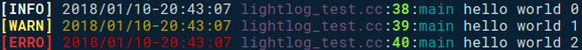

# LightLOG: A Lightweight LOG Library

### Usage

```cpp
#include "lightlog.h"

int main (int argc, char *argv[]) {
    LLOG(INFO) << "hello world " << 0;
    LLOG(WARN) << "hello world 1";
    LLOG(ERRO) << "hello world 2";
    return 0;
}
```

The results:




